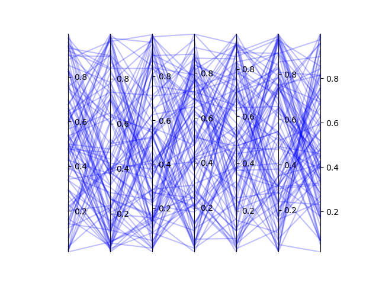

# Parallel Coordinates

Parallel Coordinates is a Python module to visualize multiobjective data using parallel coordinates.

## Installation

### Requirements
* Python3
* matplotlib
* numpy

### Manual Installation
You can use the module locally by copying the file ```parallelcoordinates.py``` into your program's directory. But if you want to be able to use this module globally copy the file to ```site-packages``` directory of your Python distribution.

## Usage

```python
from parallelcoordinates import ParallelCoordinates
import numpy as np

data = np.random.rand(100, 7)

graph = ParallelCoordinates(data)
graph.updateAlpha(0.25)
```

### Output




## Acknowledgements

This project was developed under a Research Initiation Grant, which was financed by national funds through FCT – Foundation for Science and Technology, I.P., in the scope of project CISUC – UID/CEC/00326/2020.

## License
[GPLv3](LICENSE)